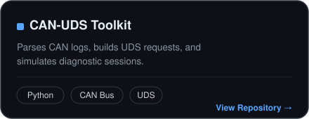
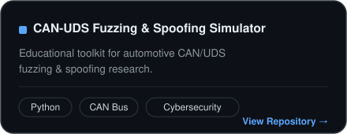
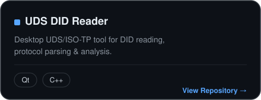
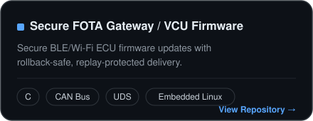

# Murat Çelik

### Embedded Software & Cybersecurity Engineer

Automotive CAN / UDS security · Secure firmware update (FOTA) · Embedded systems

&nbsp;

&nbsp;

 

Focused on automotive cybersecurity, embedded systems and software test & validation — building secure bootloader/OTA pipelines, running CAN/UDS penetration tests, and doing threat modeling (TARA) under ISO/SAE 21434 & UNECE R155/R156.

 

## Skills

| | |
|:--|:--|
| **Embedded Systems** | Embedded C · FreeRTOS · Bootloader · Bare-metal & interrupt-driven firmware · STM32 (Cortex-M3/M4) · ESP32-S3 · Embedded Linux |
| **Automotive Protocols** | CAN Bus · UDS (ISO 14229) · ISO-TP · OBD-II · UART · SPI · I2C |
| **Automotive Cybersecurity** | ISO/SAE 21434 · UNECE R155/R156 (CSMS/SUMS) · TARA & threat modeling · Penetration testing · Reverse engineering · CAN fuzzing & spoofing · Secure Boot & Secure OTA · Gateway authorization |
| **Security & Cryptography** | HSM · PKI/KMS · AES · RSA · ECDSA |
| **Test & Validation** | Requirement-based testing · Test case design & execution · ASPICE traceability · Regression testing |
| **Tools & Platforms** | Vector CANalyzer/CANoe · PeakCAN · STM32CubeIDE · Keil · MATLAB/Simulink & Stateflow |

 

## Featured Projects

<table>
<tr>
<td width="50%" align="center">

</td>
<td width="50%" align="center">

</td>
</tr>
<tr>
<td width="50%" align="center">

</td>
<td width="50%" align="center">

</td>
</tr>
</table>

 

## 🧩 Additional Work

A few projects that live outside GitHub for now:

- **Automotive Hacking Tool** — Full ECU security-testing suite: penetration testing, reverse engineering, CAN fuzzing/spoofing, seed-key brute-force cycle testing, live CAN monitoring, log-based replay, and CDD file loading.
- **HSM-Backed PKI Framework for Automotive CarPlay** — Hardware-Security-Module-backed PKI design for secure automotive CarPlay integration.
- **Embedded CAN Simulator** — CAN message transmission/reception on STM32 and Raspberry Pi, simulating ECU behavior for testing.
- **TARA Tool GUI** — Qt-based threat analysis and risk assessment tool with asset mapping and risk-matrix visualization for automotive security assessments.
- **Qt-based Dynamic PDF Generator** — Generates structured, auto-formatted PDF test/inspection reports from Qt/C++.

 

📌 More repositories → [github.com/mrtclk2?tab=repositories](https://github.com/mrtclk2?tab=repositories)

